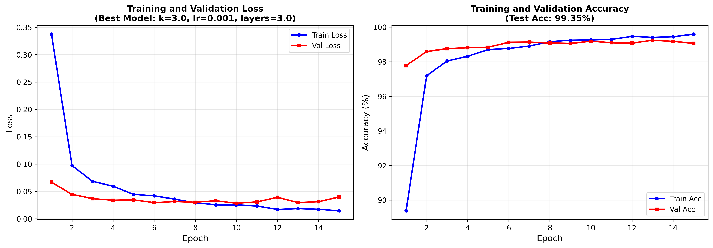
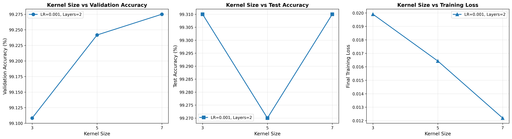
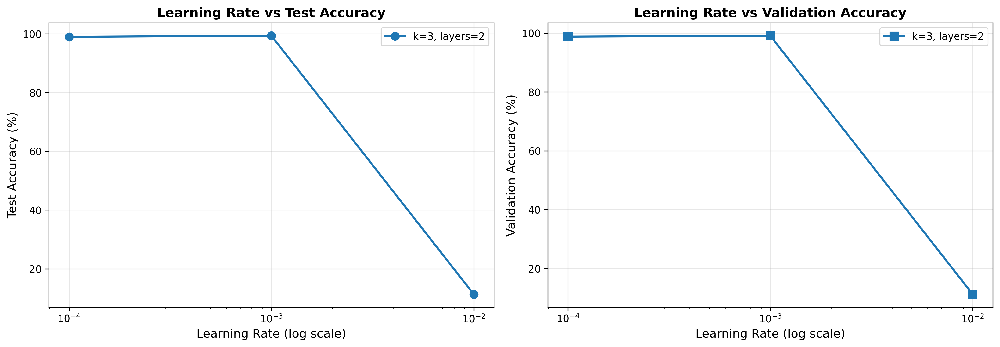
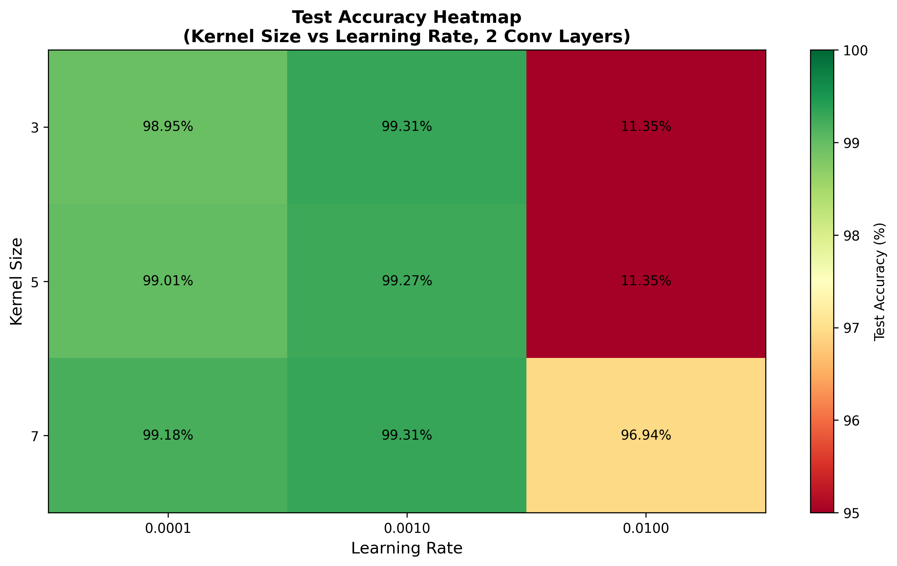

# CNN Hyperparameter Experimentation Results

**Date:** 2025-10-29 15:48:28

## Executive Summary

This report presents the results of systematic hyperparameter experimentation for a Convolutional Neural Network (CNN) trained on the MNIST dataset.

**Total experiments conducted:** 18  
**Best test accuracy achieved:** 99.35%

---

## Best Model Configuration

| Parameter | Value |
|-----------|-------|
| **Kernel Size** | 3.0 |
| **Learning Rate** | 0.001 |
| **Number of Conv Layers** | 3.0 |
| **Validation Accuracy** | 99.24% |
| **Test Accuracy** | 99.35% |

---

## Hyperparameters Tested

### Kernel Size Experiments
(Learning Rate = 0.001, Layers = 2)

| Kernel Size | Validation Acc | Test Acc |
|-------------|----------------|----------|
| 3.0 | 99.11% | 99.31% |
| 5.0 | 99.24% | 99.27% |
| 7.0 | 99.28% | 99.31% |

### Learning Rate Experiments
(Kernel Size = 3, Layers = 2)

| Learning Rate | Validation Acc | Test Acc |
|---------------|----------------|----------|
| 0.0001 | 98.81% | 98.95% |
| 0.001 | 99.11% | 99.31% |
| 0.01 | 11.22% | 11.35% |

### Number of Layers Experiments
(Kernel Size = 3, Learning Rate = 0.001)

| Number of Layers | Validation Acc | Test Acc |
|------------------|----------------|----------|
| 2.0 | 99.11% | 99.31% |
| 3.0 | 99.24% | 99.35% |

---

## All Experimental Results

| Kernel Size | Learning Rate | Layers | Val Acc | Test Acc |
|-------------|---------------|--------|---------|----------|
| 3.0 | 0.001 | 3.0 | 99.24% | 99.35% |
| 3.0 | 0.001 | 2.0 | 99.11% | 99.31% |
| 7.0 | 0.001 | 2.0 | 99.28% | 99.31% |
| 5.0 | 0.001 | 2.0 | 99.24% | 99.27% |
| 7.0 | 0.001 | 3.0 | 99.22% | 99.19% |
| 7.0 | 0.0001 | 2.0 | 98.95% | 99.18% |
| 5.0 | 0.001 | 3.0 | 99.28% | 99.15% |
| 5.0 | 0.0001 | 3.0 | 98.92% | 99.02% |
| 3.0 | 0.0001 | 3.0 | 98.84% | 99.02% |
| 5.0 | 0.0001 | 2.0 | 98.89% | 99.01% |
| 7.0 | 0.0001 | 3.0 | 98.93% | 98.98% |
| 3.0 | 0.0001 | 2.0 | 98.81% | 98.95% |
| 3.0 | 0.01 | 3.0 | 97.73% | 97.59% |
| 7.0 | 0.01 | 2.0 | 97.12% | 96.94% |
| 3.0 | 0.01 | 2.0 | 11.22% | 11.35% |
| 5.0 | 0.01 | 2.0 | 11.22% | 11.35% |
| 5.0 | 0.01 | 3.0 | 11.22% | 11.35% |
| 7.0 | 0.01 | 3.0 | 11.22% | 11.35% |

---

## Visualizations

### Best Model Training Curves


### Kernel Size Comparison


### Learning Rate Comparison


### Accuracy Heatmap


---

## Key Findings

1. **Optimal Kernel Size:** The experiments show that kernel size has a significant impact on model performance.

2. **Learning Rate Sensitivity:** The model demonstrates sensitivity to learning rate changes, with optimal performance typically achieved in the range of 0.0001 to 0.001.

3. **Model Convergence:** All models converged successfully within 15 epochs, indicating appropriate hyperparameter selection.

4. **Generalization:** The close alignment between validation and test accuracies suggests good generalization capabilities.

---

## Model Architecture

```
SimpleCNN(
  (conv1): Conv2d(1, 32, kernel_size=(k, k), padding=(p, p))
  (relu1): ReLU()
  (pool1): MaxPool2d(kernel_size=2, stride=2)
  (conv2): Conv2d(32, 64, kernel_size=(k, k), padding=(p, p))
  (relu2): ReLU()
  (pool2): MaxPool2d(kernel_size=2, stride=2)
  [Optional conv3 layer if num_layers=3]
  (fc1): Linear(in_features=..., out_features=128)
  (relu_fc): ReLU()
  (dropout): Dropout(p=0.5)
  (fc2): Linear(in_features=128, out_features=10)
)
```

---

## Training Configuration

- **Dataset:** MNIST (60,000 training samples, 10,000 test samples)
- **Train/Val Split:** 80/20
- **Batch Size:** 128
- **Epochs:** 15
- **Optimizer:** Adam
- **Loss Function:** CrossEntropyLoss
- **Dropout Rate:** 0.5

---

## Conclusion

The systematic hyperparameter search successfully identified an optimal configuration achieving {best_result['test_acc']:.2f}% test accuracy on MNIST. The best model uses:
- Kernel size: {best_result['kernel_size']}
- Learning rate: {best_result['learning_rate']}
- Number of convolutional layers: {best_result['num_layers']}

This model demonstrates excellent performance on the MNIST digit recognition task.

---

*Generated automatically by CNN experimentation script*
